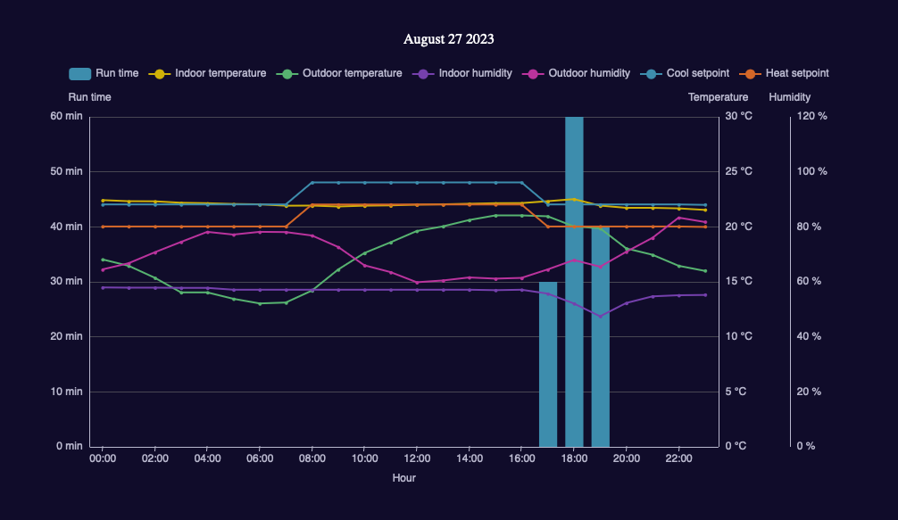

# Daikin One CLI

## Overview

Daikin One is a lightweight CLI wrapper for the [Daikin Skyport API](https://github.com/redgoose/daikin-skyport) to manage Daikin One+ devices/thermostats.

It is augmented with logging and reporting functionality to provide historical usage insights which is missing from Daikin One+ devices.



[View a sample report](https://redgoose.github.io/daikin-one/resources/sample_report.html)

## Quick Start

1. Install [Go](https://golang.org/doc/install)
2. Install `daikin-one`:

	```
	go install github.com/redgoose/daikin-one@latest
	```

3. Create a folder named `.daikin` in your home directory. Copy `config/daikin.yaml` to `.daikin/daikin.yaml` in your home directory and populate with the email and password associated with your Daikin account.

4. Get a device id for the device you want to manage:

	```
	daikin-one device ls
	```

	This will return a list of devices associated with your account:

	```json
	[
		{
			"id": "0000000-0000-0000-0000-000000000000",
			"locationId": "0000000-0000-0000-0000-000000000000",
			"name": "Main Room",
			"model": "ONEPLUS",
			"firmwareVersion": "3.2.19",
			"createdDate": 1691622040,
			"hasOwner": true,
			"hasWrite": true
		}
	]
	```

5. With a device id, you can start managing your device. For example, to retrieve device configuration and state values use:

	```
	daikin-one device info --device-id <device-id>
	```

	This will output something like:

	```json
	{
		"cspHome": 22,
		"hspHome": 20,
		"fanCirculateSpeed": 0,
		"equipmentStatus": 5,
		"humOutdoor": 73,
		"tempIndoor": 21.8,
		"tempDeltaMin": 2,
		"equipmentCommunication": 0,
		"modeEmHeatAvailable": true,
		"geofencingEnabled": true,
		"scheduleEnabled": true,
		"humIndoor": 57,
		"modeLimit": 1,
		"tempSPMin": 10,
		"fan": 0,
		"tempOutdoor": 21,
		"mode": 2,
		"tempSPMax": 32
		// snip...
	}
	```

Run `daikin-one -h` and `daikin-one device -h` for a full list of available commands.

## Logging

1. Copy `config/daikin.db` to `.daikin/daikin.db` in your home directory.
2. Run the following to log current device data:
	```
	daikin-one log -d <device-id>
	```

This will log device data to the local SQLite database only once. Stick this into cron or an equivalent tool for continuous logging. It is recommended you set your logging interval to every 5 minutes.

## Reports

Prerequisites:

* Populate `temperatureUnit` in your  `$HOME/.daikin/daikin.yaml` file.
* Ensure sufficient data has been logged via the `daikin-one log` command.
* **IMPORTANT: Logging interval must be set to every 5 minutes for accurate reports.**

### Report Summary

The report summary command will output an HTML report consisting of charts for the last 7 days, current month, and current year to `stdout`.

```
daikin-one report summary -d <device-id>
```

To output the report to a file instead, use:

```
daikin-one report summary -d <device-id> > report_summary.html
```

### Specific Day/Month/Year Reports

If the report summary doesn't include charts for the dates you're interested in, you can generate reports for a specific day/month/year as follows:

```
daikin-one report day 2023-08-19 -d <device-id> > report_day.html
daikin-one report month 2023-08 -d <device-id> > report_month.html
daikin-one report year 2023 -d <device-id> > report_year.html
```

## Limitations

* When using a variable speed heat pump, the thermostat only registers the unit as running when in high demand mode. When it is running on low, the thermostat registers the unit as idle. As a result, reports don't provide a full picture of run time. Tested with heat pump model DZ6VSA3010A, may or may not apply to other units.

## License

MIT © redgoose, see [LICENSE](https://github.com/redgoose/daikin-one/blob/master/LICENSE) for details.
